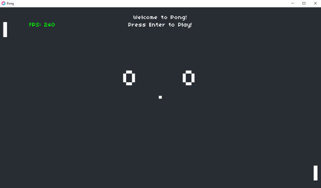

# Pong Single Player



In this version of the clkassic game Pong, the player is playing against AI. The player controls their paddle to hit a ball back and forth between them and the AI. The objective is to score points by making the ball pass the opponent's paddle.

## Table of Contents
- [Game Features](#game-features)
- [Getting Started](#getting-started)
- [Controls](#controls)
- [Code Overview](#code-overview)

## Game Features

- Single-player gameplay: Play against an AI.
- Score tracking: Keep track of both players' scores.
- Serve and play: Serve the ball and compete for points in each round.
- Victory screen: Celebrate your victory when one player reaches 10 points.

## Getting Started

1. **Prerequisites:**

   Make sure you have [Love2D](https://love2d.org/) installed on your system.

2. **Clone the Repository:**

   ```bash
   git clone https://github.com/AustynSmock/Pong1Player.git
   cd Pong1Player

3. Click and drag Pong1Player folder onto either love.exe or a shortcut to love.exe

## Controls

Player 1 (Left Paddle):
- Move Up: W
- Move Down: S

General Controls:
- Start/Restart the game: Enter/Return
- Quit the game: Escape

## Code Overview

This game is built using the Love2D framework and consists of multiple Lua scripts:

1. main.lua: This is the main entry point for the Love2D application, containing game setup and the main loop.

2. Ball.lua and Paddle.lua: These files define the Ball and Paddle classes used for game elements. They manage ball movement, collisions, and paddle behavior.

3. push.lua: This script is part of the push library used to handle screen scaling and rendering.
